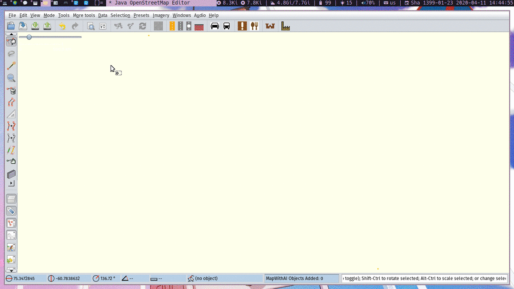
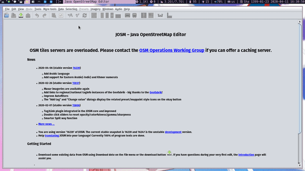

# OpenStreetMap Iranian Presets 🇮🇷

## Installation :construction:
#### Download from preset list (recommended)

- Move to Preset ↪ Preset Preferences (or Edit ↪ Preferences) ↪ the 3rd button (left) ↪ Tagging Presets.
- Find and click "Persian Presets" item in Available presets.
- Click blue arrow (▶) to move to Active presets.
- Restart JOSM.

#### Enter the URL
- Open Preset ↪ Preset Preferences (or Edit ↪ Preferences) ↪ the 3rd button(left) ↪ Tagging Presets.
- Click + button placed top right, and you will see a display.
- Click button placed next to the "URL / File" Blank, and paste the URL.
- Copy [this link](https://github.com/DearRude/IranianPresets/archive/0.01v.zip) to the panel
- Restart JOSM.

#### Apply the file directly

- Download the preset file.
- Move to Preset ↪ Preset Preferences (or Edit ↪ Preferences) ↪ the 3rd button (left) ↪ Tagging Presets
- Click + button placed top right, and you will see a display.
- Click button placed next to the "URL / File" Blank, and apply the downloaded file.
- Restart JOSM.

## Usage
Go to Presets tab and select your preset. Enjoy 😉

## TODO
- [ ] Translate this page in Persian
- [ ] Fix Icons
- [ ] Add a glossory for translated words

## Acknowladgement 🤝
- MohammadReza Nourozi for his commenting on Translation.
- Kiarash.Q for his former Iranian Presets.
  
## Contribute ✍
In order to to contribute in this project:
- You can either make an issue and explain how this project can be improved.
- Edit the files directly and pull request.
  
## Support this project 💰
Consider :star: this repo.

You also can either donate :credit_card: to [me](https://zarinp.al/@simplyebi) or [Iran OSM](https://donate.osmiran.ir/) in general.

## License :page_facing_up:
This project is licensed under Creative Commons Zero v1.0.

